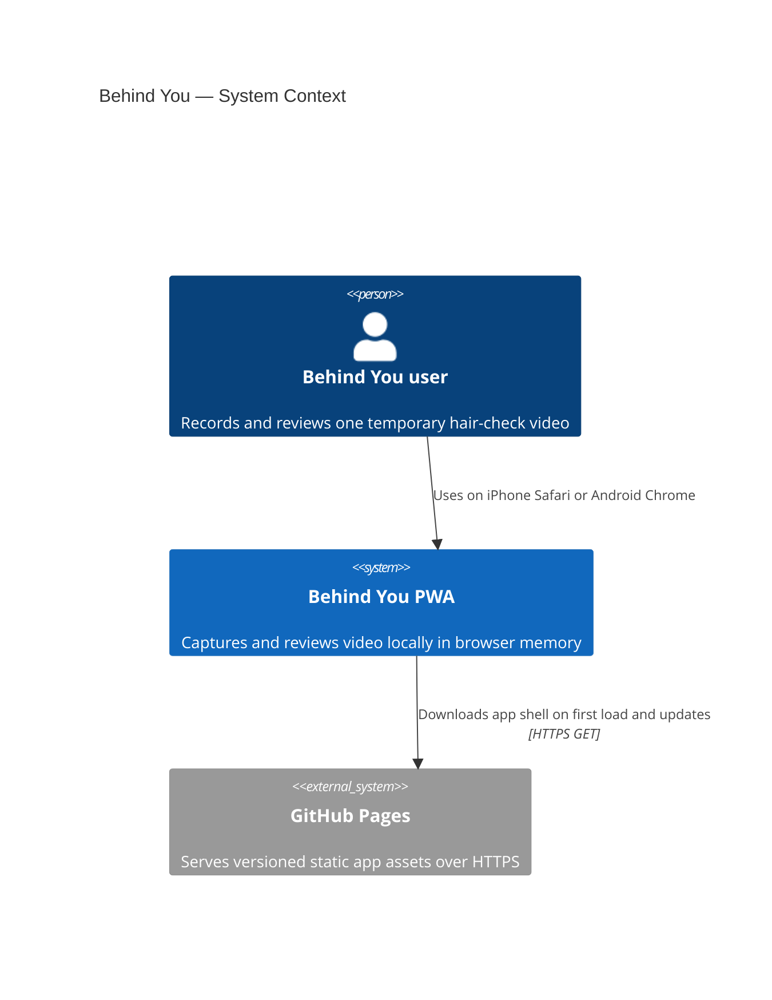
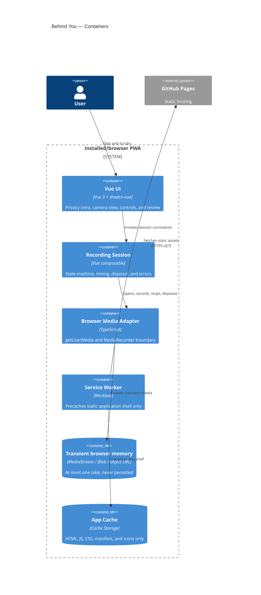
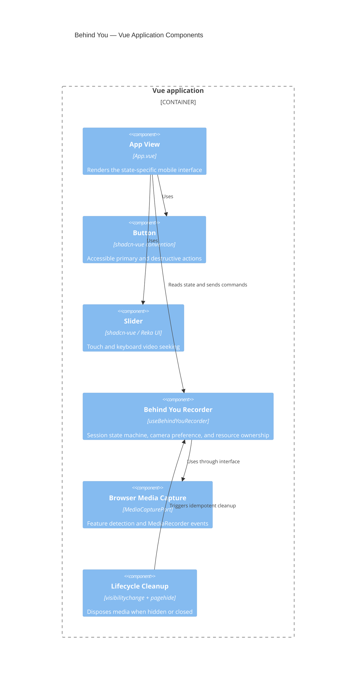
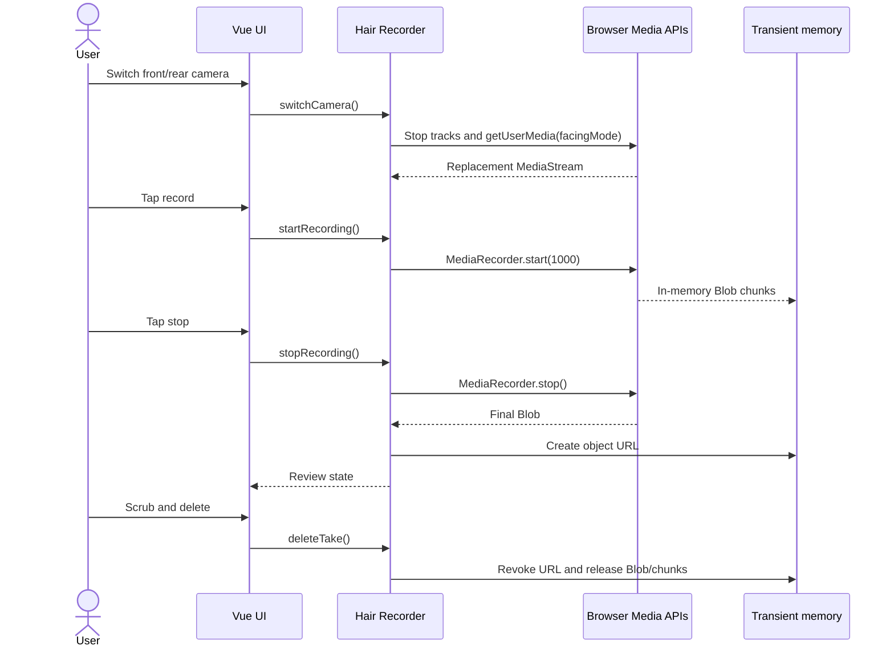
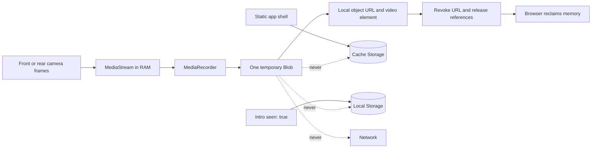

# Behind You Architecture

## Overview

Behind You is a static Vue single-page PWA. There is no application server or database. Vue coordinates a browser-media adapter, an in-memory recording session, and a full-screen mobile interface. A service worker precaches only versioned application assets.

The architecture favors widely supported browser APIs: `getUserMedia`, `MediaRecorder`, `Blob`, object URLs, HTML video, the Page Visibility API, service workers, and the Web App Manifest.

## C4 context

The recording has no relationship to GitHub Pages: it never crosses the browser boundary.

## C4 containers

## C4 components

## Session state and media lifecycle

```mermaid
stateDiagram-v2
  [*] --> intro
  intro --> requesting_permission: Open/start camera
  requesting_permission --> live: Camera stream ready
  requesting_permission --> live: Preferred camera unavailable; selfie restored
  requesting_permission --> error: Permission/device failure
  live --> recording: Start
  live --> switching_camera: Switch front/rear
  switching_camera --> live: Requested or previous camera ready
  switching_camera --> error: Request and restoration fail
  recording --> finalizing: Stop or 60-second timeout
  finalizing --> review: Blob and object URL ready
  finalizing --> error: Encoding failure
  review --> requesting_permission: New take
  review --> intro: Delete
  error --> requesting_permission: Retry
  live --> intro: Hidden/pagehide
  recording --> intro: Hidden/pagehide
  review --> intro: Hidden/pagehide
```

## Privacy and data flow

Only `behind-you:privacy-intro-seen:v1=true` and `behind-you:camera-facing:v1=user|environment` persist. No timestamp, identity, device ID, usage count, frame, thumbnail, audio, or video is stored. A legacy privacy preference is migrated once and its obsolete key is removed.

## Compatibility and failure handling

- Camera access is available only on HTTPS or localhost and always remains subject to browser permission.
- The default selfie request uses an ideal `facingMode`; explicit switching uses an exact front/rear constraint so the browser cannot silently return the wrong lens.
- If an exact lens is unavailable, the adapter reopens the previous working camera. Front footage is mirrored in the UI and rear footage retains its natural orientation.
- Media MIME types are selected with `MediaRecorder.isTypeSupported`, preferring MP4/H.264 and falling back to WebM/VP8 or the browser default.
- The same browser records and plays a take, avoiding cross-device codec transfer concerns.
- Recorder time slices are not used as a clock. A monotonic timer controls the 60-second maximum.
- Permission denial, no camera, busy camera, unsupported APIs, and encoding errors map to user-actionable error states.
- Cleanup is idempotent because `visibilitychange`, `pagehide`, component unmount, and user actions can overlap.

## Offline and update model

`vite-plugin-pwa` generates the manifest and Workbox service worker. Its precache glob includes only HTML, JavaScript, CSS, SVG, and the web manifest. There is no runtime cache and no path that sends `blob:` media to the worker. A new service worker waits until existing app clients close, preventing an update from interrupting a session.

## Deferred low-light enhancement

The optional low-light frame is intentionally outside version one. A later implementation may sample very small, downscaled frames with `requestVideoFrameCallback`, compute luminance locally, immediately clear the canvas, and display a bright border below a calibrated threshold. It must not retain frames, introduce a new permission, or change the no-network guarantee.
